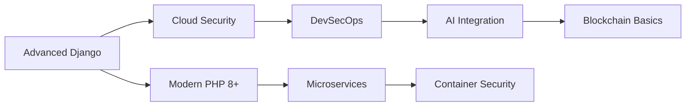

# Felix Aliguma - Software Engineer

<div align="center">
  
  <!-- Dynamic Header -->
  
  
  <!-- Profile Views & Typing Animation -->
  
  
  <br/>
  
  
  
</div>

---

## 🚀 About Me

<table>
<tr>
<td width="55%" valign="top">

### 👨‍💻 Professional Overview

**🏢 Company:** `felix.dev technologies`  
**📍 Location:** Kampala, Uganda 🇺🇬  
**💼 Position:** Founder & Lead Software Engineer  
**🎯 Specialization:** Full-Stack Development & Security  

### 🎨 What Drives Me

```javascript
const felix = {
    code: ['PHP', 'Python', 'JavaScript', 'SQL'],
    frameworks: ['Django', 'Laravel', 'React'],
    design: ['Figma', 'Adobe XD', 'Photoshop'],
    security: ['Ethical Hacking', 'Penetration Testing'],
    databases: ['MySQL', 'PostgreSQL', 'MongoDB'],
    currentFocus: 'Building secure, user-centric applications',
    philosophy: 'Code with purpose, design with empathy'
};
```

### 🌟 Mission Statement
*"Crafting digital experiences that seamlessly blend cutting-edge technology with robust security, ensuring every line of code serves both functionality and protection."*

</td>
<td width="45%" valign="top">

<div align="center">

### 📊 GitHub Insights


<br/><br/>


</div>

</td>
</tr>
</table>

---

## 🛠️ Technology Arsenal

<div align="center">

### 💻 Programming Languages


### 🚀 Frameworks & Libraries  


### 🎨 Design & UI/UX Tools


### 🗄️ Databases & Backend


### ⚙️ Development Tools


### 🔐 Security & Testing


</div>

### 📈 Expertise Levels

<table width="100%">
<tr>
<td width="50%">

| **Backend Development** | **Level** |
|-------------------------|-----------|
| PHP | ████████████████████ 95% |
| Python | ████████████████ 80% |
| Django | ██████████████ 70% |
| MySQL | ████████████████████ 90% |

</td>
<td width="50%">

| **Frontend & Design** | **Level** |
|-----------------------|-----------|
| JavaScript | ████████████████ 80% |
| UI/UX Design | ████████████████████ 95% |
| Figma | ████████████████████ 98% |
| CSS/HTML | ████████████████████ 90% |

</td>
</tr>
</table>

---

## 📊 GitHub Analytics Dashboard

<div align="center">

<table width="100%">
<tr>
<td width="50%">

</td>
<td width="50%">

</td>
</tr>
</table>

<br/>


</div>

---

## 🎯 Current Focus & Projects

<div align="center">

### 🚧 Active Developments

<table>
<tr>
<td align="center" width="33%">

<br/>
<sub><b>E-commerce Platform</b></sub>
<br/>
<sub>PHP • MySQL • JavaScript</sub>
</td>
<td align="center" width="33%">

<br/>
<sub><b>Django Mastery</b></sub>
<br/>
<sub>Advanced Web Framework</sub>
</td>
<td align="center" width="33%">

<br/>
<sub><b>Cybersecurity Tools</b></sub>
<br/>
<sub>Ethical Hacking • Pentesting</sub>
</td>
</tr>
</table>

### 📚 Learning Roadmap 2024-2025



</div>

---

## 🏆 Achievements & Milestones

<div align="center">


<br/>

### 📈 Professional Milestones


</div>

---

## 💼 Services & Expertise

<div align="center">

<table width="100%">
<tr>
<td align="center" width="25%">

<br/>
<sub>Full-stack web applications with modern frameworks</sub>
</td>
<td align="center" width="25%">

<br/>
<sub>User-centered design with prototyping & testing</sub>
</td>
<td align="center" width="25%">

<br/>
<sub>Vulnerability assessment & penetration testing</sub>
</td>
<td align="center" width="25%">

<br/>
<sub>Scalable database architecture & optimization</sub>
</td>
</tr>
</table>

</div>

---

## 🌐 Let's Connect & Collaborate

<div align="center">

### 📱 Social Links

<a href="https://x.com/FelixA117" target="_blank">

</a>
<a href="https://www.linkedin.com/in/felix-aliguma-640a10228/" target="_blank">

</a>
<a href="mailto:aligumafelix117@gmail.com">

</a>
<a href="https://stackoverflow.com/users/felix-aliguma" target="_blank">

</a>

<br/><br/>

### 🤝 Collaboration Opportunities

<table>
<tr>
<td align="center">

</td>
<td align="center">

</td>
<td align="center">

</td>
</tr>
</table>


</div>

---

<div align="center">

### 💫 Random Dev Quote


<br/><br/>

<!-- Footer Wave -->


### 🎯 *"Building tomorrow's web, securing today's digital world"*


---

**⭐ Don't forget to star repositories you find interesting! ⭐**

</div>
